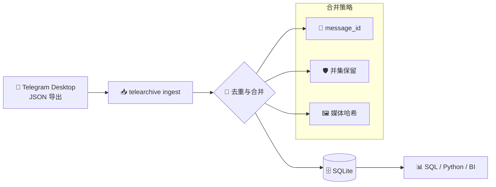

<div align="center">

# 📦 TeleArchive

**Telegram 群聊归档与智能合并工具**

将 Telegram Desktop 手动导出的 JSON 记录，去重、拼接并写入本地数据库，形成可持续积累、便于分析的完整聊天档案。

<br>

[](https://github.com/StephenDeng01/TeleArchive/releases)
[](https://www.python.org/)
[](https://www.sqlite.org/)
[]()

[🚀 快速开始](#-快速开始) · [🪟 Windows 下载](#-windows-用户) · [⚙️ 工作原理](#️-工作原理) · [📊 数据分析](#-数据分析) · [🛠 参与开发](#-参与开发)

<br>

</div>

---

## 📋 概述

TeleArchive 面向 **无法使用 Telegram Bot / 官方 API**，但仍需长期留存与分析群聊内容的场景。当群组启用消息自动删除、或需定期手动导出时，历史记录往往被拆成多段、且批次之间存在重叠。

本工具在本地完成以下工作：

| | 能力 |
|---|---|
| 🔀 | **合并**多批次 `result.json`，按消息 ID 去重，形成时间有序的完整时间线 |
| 🛡️ | **保留**较新导出中已消失、但旧导出仍保留的消息（并集策略） |
| 🖼️ | **索引**图片、视频等媒体文件的磁盘路径，并识别跨批次重命名的同一附件 |
| 🗄️ | **输出**标准 SQLite 数据库，支持 SQL、Python、pandas 等任意分析方式 |
| 🌐 | **内嵌看板**：Qt 原生 WebEngine 渲染 Telegram 风格 HTML，无需外部浏览器 |

🔒 全程离线运行，数据不离开本机。

---

## 🎯 适用场景

| 场景 | 说明 |
|------|------|
| ⏳ 群消息 TTL 自动删除 | 定期导出，合并后尽可能还原完整历史 |
| 🚫 无法申请 API | 仅依赖 Telegram Desktop 官方导出能力 |
| 📂 分段导出、内容重叠 | 自动去重，避免重复计数 |
| 🔍 群聊研究与复盘 | 结构化入库，便于统计、检索与关联分析 |

---

## ✨ 特性

- 🔗 **并集合并** — 新导出更短时，不丢弃旧导出独有的消息
- 🔑 **稳定去重** — 以 `(chat_id, message_id)` 为唯一键，与 Telegram 导出规范一致
- 📎 **媒体感知** — 解析 JSON 相对路径，校验文件存在，按内容哈希关联跨批次附件
- 🧭 **批次可追溯** — 记录每条消息的首次来源导出与导入历史
- 🌐 **内嵌看板** — 使用 Qt WebEngine 渲染 Telegram 原生 HTML，支持图片、贴纸、emoji
- 📅 **时间范围** — 看板与导出均支持 UTC+8 精确到秒；五个快捷按钮（今天/近三天/近一周/近一月/全部）
- 🔔 **更新提醒** — 启动时自动检查 GitHub 新版本，支持应用内一键更新（SHA256 校验）
- 📥 **开箱即用** — Windows 单文件 `.exe`，双击即可使用；无需 Python 环境、无需 WebView2

---

## 🚀 快速开始

### 📌 环境要求

- [Telegram Desktop](https://desktop.telegram.org/) **≥ 4.15.2**（支持 JSON 格式导出）
- Python **3.9+**（仅源码安装时需要）

### 📤 导出聊天记录

在目标群聊中：**右键聊天标题 → Export chat history**

- 格式选择 **JSON**
- 可按需限制媒体体积（仅分析文本时可设为 0 MB 以加快速度）

每次导出将生成一个独立文件夹，例如：

```
ChatExport_2026-05-26/
├── result.json
├── photos/
├── video_files/
└── stickers/
```

> 💡 **说明**：`result.json` 仅包含消息元数据与媒体**相对路径**；实际文件存放于同级子目录中。导入时请提供**完整导出文件夹**，而非单独的 JSON 文件。

### 📥 安装

**方式 A — Windows 桌面版（推荐普通用户）**

1. 前往 [Releases](https://github.com/StephenDeng01/TeleArchive/releases) 下载最新版 **`TeleArchive.exe`**
2. **双击运行**，无需安装 Python，无需命令行
3. 在界面中添加导出文件夹 → 点击 **「导入合并」**

详见 [Windows 用户](#-windows-用户)。

**方式 B — 从源码安装（开发者）**

```bash
git clone https://github.com/StephenDeng01/TeleArchive.git
cd TeleArchive
python3 -m venv .venv
source .venv/bin/activate          # Windows: .venv\Scripts\activate
pip install -e .
```

### ⌨️ 基本用法

```bash
# 初始化本地数据库
telearchive init

# 导入单批导出
telearchive ingest ~/Downloads/ChatExport_2026-05-20

# 导入多批导出（自动按时间从旧到新合并）
telearchive ingest ~/Downloads/ChatExport_2026-05-20 ~/Downloads/ChatExport_2026-05-26

# 导入父目录（自动发现其下全部 ChatExport_* 文件夹）
telearchive ingest ~/TeleArchive/exports

# 查看合并结果
telearchive status

# 分析 message ID 空洞（通常对应已自动删除的消息）
telearchive gaps --min-gap 10
```

默认数据库路径：`E:/tg_chat_history/telearchive.db`（Windows；不可用则回退 `data/telearchive.db`）

```bash
telearchive ingest --db /path/to/archive.db ./exports/batch1
```

---

## ⚙️ 工作原理



| 维度 | 策略 |
|------|------|
| 🔑 消息去重 | `(chat_id, message_id)` 主键；单群内 ID 唯一 |
| 🔀 重叠批次 | 取并集；较新导出缺失的消息由较早导出补充 |
| ✏️ 消息编辑 | 依据 `edited_unixtime` 或内容变更更新记录 |
| 🕐 时间排序 | `date_unixtime` + `message_id` 联合索引 |
| 📄 原始数据 | `raw_json` 字段保留完整导出条目 |
| 🖼️ 媒体文件 | 写入 `media_locations`；`message_media` 提供首选访问路径 |
| 📅 导入顺序 | 多批次按消息时间**从旧到新**依次合并 |

### 📎 媒体文件说明

Telegram 在不同导出批次中可能对同一附件使用不同文件名（如 `photo_27@...` 与 `photo_1@...`）。TeleArchive 通过 **文件内容哈希** 识别等价附件，并在 `media_locations` 中保留各批次的实际路径。

查询时建议使用：

```sql
SELECT preferred_absolute_path FROM message_media WHERE ...;
```

---

## 📟 命令参考

| 命令 | 说明 |
|------|------|
| `telearchive init` | 🗄️ 初始化数据库表结构 |
| `telearchive ingest <路径…>` | 📥 导入并合并一个或多个导出目录 / `result.json` |
| `telearchive status` | 📊 查看群聊消息统计、媒体索引与导入历史 |
| `telearchive gaps` | 🕳️ 分析 message ID 序列空洞与各批次覆盖情况 |
| `telearchive version` | ℹ️ 显示当前版本 |
| `telearchive check-update` | 🔔 检查是否有新版本（仅提醒） |
| `telearchive export <目录>` | 📤 按时间范围导出为 Telegram JSON 目录 |

全局选项：`--db <路径>` 指定数据库文件（默认自动选择：`E:/tg_chat_history/telearchive.db` 或 `data/telearchive.db`）。

### 📤 按时间导出

从已合并的数据库中，导出指定时间段内的聊天记录，目录结构与 **Telegram Desktop 原生导出** 一致：

```
export_slice/
├── result.json
├── photos/
├── video_files/
└── stickers/
```

```bash
# 导出 2026 年 5 月的消息（含媒体文件）
telearchive export ./export_slice --from 2026-05-01 --to 2026-05-31

# 仅导出 JSON，不复制图片/视频
telearchive export ./export_slice --from 2026-05-01 --to 2026-05-31 --no-media

# 指定群聊（数据库中有多个群时必填）
telearchive export ./export_slice --chat-id 2837935940 --from 2026-05-20 --to 2026-05-26
```

图形界面左侧提供 **「按时间导出」** 区域，填写起止时间与输出目录，并有五个快捷按钮（今天、近三天、近一周、近一月、全部消息）即可一键导出。

### 🔔 更新提醒

- 启动图形界面后，自动检查 [GitHub Releases](https://github.com/StephenDeng01/TeleArchive/releases) 是否有新版本
- **不强制更新**：可继续使用当前版本
- **立即更新（Windows）**：下载新版本后执行 SHA256 校验，通过后静默替换并自动重启
- **稍后**：关闭对话框，下次启动仍会提示
- 偏好保存在 `data/settings.json`

`version.json` 中包含 `sha256` 字段；应用仅在存在且校验通过时执行"立即更新"。

命令行手动检查：

```bash
telearchive check-update
telearchive check-update --dismiss 0.3.0   # 不再提示指定版本
```

---

## 📊 数据分析

数据库为标准 SQLite，可使用任意客户端或脚本访问。

```bash
sqlite3 E:/tg_chat_history/telearchive.db
```

```sql
-- 最近 50 条文本消息
SELECT datetime(date_unixtime, 'unixepoch') AS time,
       from_name,
       text
FROM messages
WHERE chat_id = :chat_id
  AND text IS NOT NULL
ORDER BY date_unixtime DESC
LIMIT 50;

-- 按成员统计发言量
SELECT from_name, COUNT(*) AS count
FROM messages
WHERE chat_id = :chat_id
  AND msg_type = 'message'
GROUP BY from_id
ORDER BY count DESC;

-- 带图片且文件仍存在于磁盘
SELECT m.date_iso,
       m.from_name,
       mm.preferred_absolute_path
FROM messages m
JOIN message_media mm
  ON mm.chat_id = m.chat_id
 AND mm.message_id = m.message_id
WHERE m.chat_id = :chat_id
  AND mm.media_kind = 'photo'
ORDER BY m.date_unixtime DESC
LIMIT 20;
```

Python 示例：

```python
import sqlite3
import pandas as pd

conn = sqlite3.connect("E:/tg_chat_history/telearchive.db")
df = pd.read_sql("SELECT * FROM messages WHERE chat_id = ?", conn, params=(chat_id,))
```

---

## 🔄 推荐工作流

1. 📁 **固定目录** — 例如 `~/TeleArchive/exports/`，每次导出以日期命名子文件夹
2. 🔁 **定期导入** — `telearchive ingest ~/TeleArchive/exports/*`
3. ✅ **核对增量** — `telearchive status` 确认消息总数与时间跨度持续扩展
4. 💾 **保留原始导出** — 数据库记录的是路径引用，请勿删除仍被索引的导出文件夹

---

## 🪟 Windows 用户

### ⬇️ 下载

1. 打开 [Releases](https://github.com/StephenDeng01/TeleArchive/releases)
2. 下载 **`TeleArchive.exe`**（单文件，免安装，约 50–80 MB，含 Qt WebEngine）
3. **无需安装 Python、无需 WebView2、无需其他依赖**，双击即可运行

### 🖥️ 图形界面操作流程

**双击 `TeleArchive.exe`** 打开，界面分为左右两栏：

**左栏 — 操作区**

| 步骤 | 操作 |
|------|------|
| 1 | **选择数据库** — 默认 `E:\tg_chat_history\telearchive.db`；点「浏览」可更改 |
| 2 | **添加导出文件夹** — 选择 `ChatExport_*` 目录，支持多个 |
| 3 | **初始化数据库** — 首次使用时点击创建表结构（已存在时自动提示跳过） |
| 4 | **导入合并** — 一键将选中文件夹去重合并入库 |
| 5 | **检查更新** — 查看是否有新版本，可选一键更新 |
| 6 | **按时间导出** — 填写起止时间与输出目录，或点快捷按钮，再点「导出」 |

**右栏 — 聊天看板**

- 使用 **Qt WebEngine** 内嵌渲染 Telegram 风格 HTML，支持图片、贴纸、emoji、视频缩略图
- 填写时间范围，或点击 **今天 / 近三天 / 近一周 / 近一月 / 全部消息** 快捷按钮
- 点击 **「刷新预览」** 生成并加载看板，结果缓存于本地

> ⏱️ **时间格式**：`YYYY-MM-DD` 或 `YYYY-MM-DDTHH:MM:SS`，均为 **UTC+8**

### ⌨️ 命令行（高级）

若需脚本化或批处理，可加 `--cli` 使用命令行模式：

```powershell
.\TeleArchive.exe --cli ingest "D:\Downloads\ChatExport_2026-05-26"
.\TeleArchive.exe --cli status
.\TeleArchive.exe --cli gaps --min-gap 10
```

### 🔨 自行构建

```powershell
git clone https://github.com/StephenDeng01/TeleArchive.git
cd TeleArchive
pip install ".[build]"
pyinstaller --noconfirm --clean telearchive.spec
# 输出: dist\TeleArchive.exe
```

### 🚢 发布新版本（维护者）

1. 更新 `telearchive/__init__.py` 和 `pyproject.toml` 中的版本号
2. 推送 tag：

```bash
git tag v0.9.0
git push origin v0.9.0
```

推送 `v*` 标签后，GitHub Actions 将自动构建并发布至 Releases，附带 `TeleArchive.exe`、`TeleArchive.exe.sha256`、`TeleArchive-X.Y.Z-win64.zip`。

---

## 🛠 参与开发

```bash
pip install -e ".[dev]"
pytest
```

构建 Windows 安装包：

```bash
pip install -e ".[build]"
pyinstaller telearchive.spec
```

依赖说明：

| 包 | 说明 |
|----|------|
| `PySide6` | Qt 6 Python 绑定（GUI 框架） |
| `PySide6-Addons` | 含 QtWebEngine（内嵌 HTML 看板） |
| `click` / `typer` / `rich` | CLI 框架与终端输出 |

---

## 📚 参考

- 📄 [Telegram Data Export Schema](https://core.telegram.org/import-export) — 官方 JSON 导出字段说明
- 💬 [Telegram Desktop](https://desktop.telegram.org/) — 客户端下载
- 🖼️ [Qt for Python (PySide6)](https://doc.qt.io/qtforpython-6/) — GUI 框架文档

---

<div align="center">

**📦 TeleArchive** — 让分散的聊天导出，成为可追溯、可分析的完整档案。

<br>

💬 如有问题或建议，欢迎提交 [Issue](https://github.com/StephenDeng01/TeleArchive/issues)。

</div>
